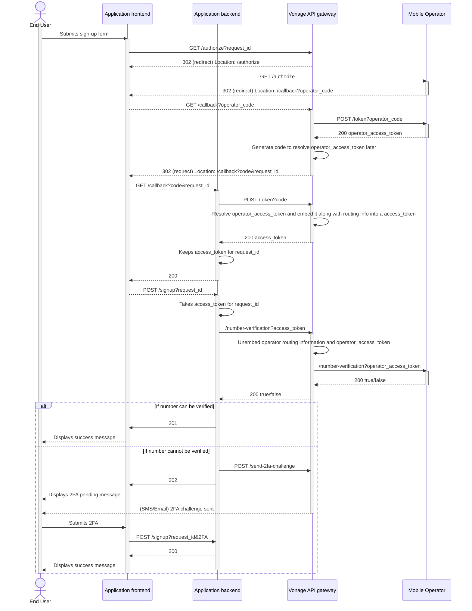

# WeAreDevelopers World Congress 2025
## Workshop: "Integrating Open Gateway in your application to shift to a better sign-up experience"

## Overview
In this workshop, we will explore how to integrate Open Gateway into your application to enhance a secure sign-up experience. Open Gateway provides a standardized way to manage user identities and streamline the authentication process.

## Prerequisites
- Basic understanding of web development and APIs.
- Familiarity with OAuth 2.0 and OpenID Connect concepts.
- A development environment set up with Node.js and npm.
- A Vonage account.

## Objectives
You will start by testing an existing application implementing a regular sign-up flow, with verification links via email or OTP codes via SMS as two factor authentication. Then, you will learn how to integrate Open Gateway into your application to improve the sign-up experience by getting rid of emails and SMSs. By the end of this workshop, you will be able to:
- Understand the benefits of using Open Gateway for user authentication.
- Implement Open Gateway in your application.
- Enhance the user sign-up experience by reducing friction and improving security.

## Workshop Agenda
1. **Introduction to Open Gateway**
   - Overview of Open Gateway and its benefits.
   - Discussion on user authentication challenges.
2. **Setting Up the Environment**
   - Installing necessary tools and libraries.
   - Setting up this sample application.
3. **Create your Vonage account**
   - Sign up for a Vonage account.
   - Create an application in the Vonage Developer Portal.
   - Obtain API keys and secrets.
   - Configure the application to use Open Gateway.
   - Setup your redirect URI.
4. **Run the regular flow**
   - Test the existing application to understand the current user experience.
5. **Integrating Open Gateway**
   - Implement Open Gateway in the application.
   - Replace email and SMS verification with Open Gateway.
   - Test the new sign-up flow.

## Tech Stack
- **Frontend**: React.js, MUI
- **Backend**: Node.js, Express

## Architecture

Top down list of components:
- **Sample Application**:
	- Composed by frontend and backend, allows users to sign up.
	- This is the application you will be working on during the workshop.
	- On the initial stage, it does not use Open Gateway, but a regular sign-up flow with verification links via email or OTP codes via SMS.
- **Vonage Communication API Gateway**:
	- Provides the necessary APIs for Email and SMS.
	- Used in the initial stage of the sample application, and in the final stage as a fallback from Open Gateway for two factor authentication.
- **Open Gateway API Gateway**:
	- Aggregates mobile operators and route your authentication and verification API calls.
	- Vonage will provide the Open Gateway API Gateway, and you will create an application in the Vonage Developer Portal to use it.
	- To be used in the final stage of the sample application, replacing the regular sign-up flow with a better user experience.
- **Mobile Operators**:
	- Which effectively authenticate and verifies end-user's identity.

## Sample Application
- **Frontend**: [GitHub Repository](https://github.com/Telefonica/ogw-wad2025-workshop-frontend)
- **Backend**: [GitHub Repository](https://github.com/Telefonica/ogw-wad2025-workshop-backend)

## Interaction Flow

In the following guide, you will find a sequence diagram on how this components interact with each other during the frontend authentication flow (based on end-user network connectivity).

https://developers.opengateway.telefonica.com/docs/frontend

> Note: For this workshop, Vonage will play the role of the Channel Partner by providing its Open Gateway API Gateway

Below is a simplified sequence diagram which completes frontend authentication with the end of the sign-up process, referring the interaction points you will find, or will need to implement, in the sample application:

